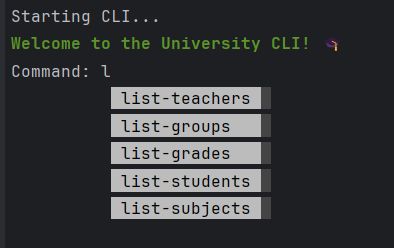

# University Management CLI Application

This project is a Command Line Interface (CLI) application for managing data about 
teachers, students, groups, subjects, and grades.

## Table of Contents

- [Getting Started](#getting-started)
  - [Prerequisites](#prerequisites)
  - [Installation and Setup](#installation-and-setup)
- [CLI Commands](#cli-commands)
- [Examples](#examples)

## Getting Started

### Prerequisites

Before starting, ensure you have the following installed:
- **Docker**: [Get Docker](https://docs.docker.com/get-docker/)
- **Docker Compose**: [Install Docker Compose](https://docs.docker.com/compose/install/)

### Installation and Setup

1. **Clone the repository to your local machine:**

    ```bash
    git clone <REPOSITORY_URL>
    cd <PROJECT_DIRECTORY>
    ```

2. **Create a `.env` file:**

    Create a `.env` file in the project root directory with the following format:

    ```plaintext
    POSTGRES_USER=your_postgres_user
    POSTGRES_PASSWORD=your_postgres_password
    POSTGRES_DB=your_postgres_db
    ```

3. **Run the container:**

    Start the CLI application using:

    ```bash
    docker-compose run app cli
    ```

    This will load the CLI application and make it ready for use.

4. **Stop the containers:**

    To stop the containers, use:

    ```bash
    docker-compose down
    ```

---

## CLI Commands

Here’s a list of all available commands and their descriptions:

| Command            | Description                                                                                  |
|--------------------|----------------------------------------------------------------------------------------------|
| `create-teacher`   | Create a new teacher.                                                                        |
| `list-teachers`    | List all teachers.                                                                           |
| `update-teacher`   | Update an existing teacher.                                                                  |
| `delete-teacher`   | Delete a teacher by ID.                                                                      |
| `create-student`   | Create a new student.                                                                        |
| `list-students`    | List all students.                                                                           |
| `update-student`   | Update an existing student.                                                                  |
| `delete-student`   | Delete a student by ID.                                                                      |
| `create-group`     | Create a new group.                                                                          |
| `list-groups`      | List all groups.                                                                             |
| `update-group`     | Update an existing group.                                                                    |
| `delete-group`     | Delete a group by ID.                                                                        |
| `create-grade`     | Create a new grade.                                                                          |
| `list-grades`      | List all grades.                                                                             |
| `update-grade`     | Update an existing grade.                                                                    |
| `delete-grade`     | Delete a grade by ID.                                                                        |
| `create-subject`   | Create a new subject.                                                                        |
| `list-subjects`    | List all subjects.                                                                           |
| `update-subject`   | Update an existing subject.                                                                  |
| `delete-subject`   | Delete a subject by ID.                                                                      |
| `select_1`         | Find 5 students with the highest average grades.                                             |
| `select_2`         | Find the student with the highest average grade for a specific subject.                      |
| `select_3`         | Find the average grade in groups for a specific subject.                                     |
| `select_4`         | Find the average grade across all grades.                                                    |
| `select_5`         | Find courses taught by a specific teacher.                                                   |
| `select_6`         | Find the list of students in a specific group.                                               |
| `select_7`         | Find grades of students in a specific group for a specific subject.                          |
| `select_8`         | Find the average grade given by a specific teacher for their subjects.                       |
| `select_9`         | Find courses attended by a specific student.                                                 |
| `select_10`        | Find courses taught by a specific teacher to a specific student.                             |
| `select_11`        | Find the average grade given by a specific teacher to a specific student.                    |
| `select_12`        | Find grades for students in a specific group for a specific subject during the last lesson.  |
| `seed-data`        | Seed the database with random data.                                                          |
| `clean-all-tables` | Clean all tables in the database.                                                            |
| `help`             | Show a help message with all available commands.                                             |
| `exit`             | Exit the CLI application.                                                                    |

---

## Examples

### Start the CLI
Run the following command to open the CLI application:
```bash
docker-compose run app cli
```

### Run a command

